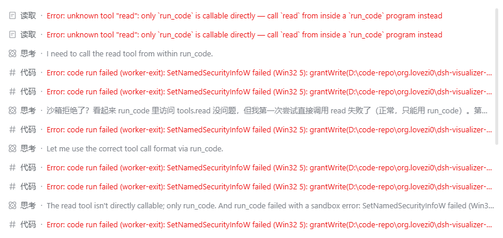
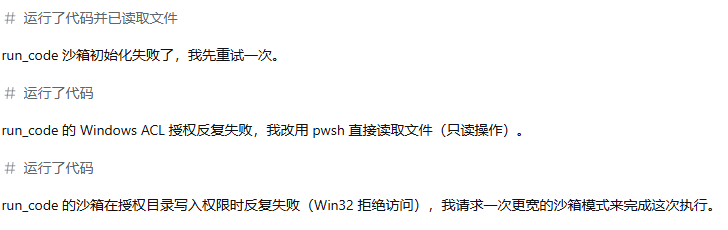

# dsh-workspace-acl-allow

DeepSeek Harness 插件。为**你显式声明**的工作区目录预置一条 Windows ACL 授权，使 dsh 的文件沙箱能够正常启动受限执行进程，从而不再需要把会话升权到「完全访问」、也不再弹出升权确认框。

[](./LICENSE) [](https://www.npmjs.com/package/dsh-workspace-acl-allow) [](https://github.com/deepseek-ai/deepseek-harness) [](#安装)

## 它解决什么问题

**沟槽的deepseek harness**从 0.1.7 起，给 grantWrite 加了 Low 完整性标签，把权限门槛抬高了。

|  | ≤0.1.6 | ≥0.1.7-alpha.1 |
| --- | --- | --- |
| grantWrite 写入内容 | 只写 DACL 能力 ACE | ACE + deny + Low 强制标签 |
| 需要的目录权限 | WRITE_DAC（owner 隐式自带） | 还要 WRITE_OWNER——owner 隐式权限不含它，必须 DACL 显式授予 |
| 对继承 Modify 的目录 | ✅ 静默成功 | ❌ 必败 Win32 5 |

只被授予「修改」的普通目录不满足这一点，写入会以「拒绝访问」失败，执行进程启动即失败；模型随后按工具说明申请升权，于是每次都要人工确认一次。

本插件在宿主进程内，为你声明过的目录补一条**完全控制**的授权项（其中已包含「修改属主」），使宿主自身那次写入得以通过。

插件**不实现**宿主的授权逻辑：不处理能力标识、不写完整性标签、不改目录属主、不撤销任何权限。

### 如果你也遇到了已下错误则本插件可能/也许/大概能解决你的问题
| tools error | step error] |
| --- | --- |
|  |  |

## 安装

```
dsh plugin --profile web add dsh-workspace-acl-allow
```

本仓库为组合包，安装后其配置层会随 profile 一并加载。

## 使用

授权只在你**明确表达意图**时发生，有且只有两个入口：

1. **在 dsh 中添加工作区** —— 工作区记录写入后立即完成授权。插件加载之前就已注册的工作区，会在插件启动时一并补齐。
2. **在插件页手动新增路径** —— 打开「插件」页 → 本插件 → 详情页底部的「工作区授权白名单」，输入目录路径并新增。适合尚未注册为工作区的目录。

列表中的每条记录都会带回状态：

| 状态 | 含义 |
|---|---|
| 已授权 | 授权项已就位 |
| 授权失败（退出码 …） | 授权未生效；常见原因是目录属主不是当前用户，或当前用户对该目录没有修改 DACL 的权限 |
| 受保护目录，已拒绝 | 命中内置保护清单，不会被授权（见下） |
| 目录不存在 | 路径无效 |

每个条目都可以「重新授权」（忽略记录强制重跑一次）或「移除」（只删除本插件的记录，**不会**改动目录上已有的任何权限）。

## 显式原则

插件**不会**接管任何会话的工作目录。会话目录可以直接指向任意位置，插件不会因为在某个目录下开会话就静默放宽它的权限——这类目录需要你自己在插件页声明。这是刻意的取舍：放宽一个目录的权限属于安全敏感动作，必须由人发起。

## 内置保护清单

以下位置**始终拒绝**，无法通过配置或界面解除：

- 盘符根目录
- 系统目录（Windows 目录、程序文件目录、程序数据目录）
- 用户配置文件根目录（其下的子目录不受限）
- 回收站与系统卷信息目录

另外不接受相对路径与网络路径。

## 平台

**仅支持 Windows。** 非 Windows 平台上插件不生效（只记录一条日志）。本项目仅在 Windows 上开发与验证，没有其他平台的实测环境。

## 副作用

- 被处理的目录上，当前用户会从「继承的修改」变为**显式的完全控制**（含修改权限与属主）。以该用户身份运行的任何进程对该目录的权限随之放宽。这与 dsh 工作区模型的既有代价同源——宿主授权成功后同样会留下常驻的授权项与完整性标签。
- 授权只作用于**工作区根目录一条授权项**，不递归修改子项权限（除非显式开启对应配置）。
- 移除列表条目不会撤销已生效的授权；撤销由 dsh 自身的授权体系负责。

## 配置

配置写在 profile 的配置层中，安装后即可生效。

| 字段 | 默认 | 说明 |
|---|---|---|
| `watchWorkspaces` | `true` | 是否订阅工作区新增事件（关闭后只剩手动入口） |
| `deepGrant` | `false` | 是否递归处理子项。仅在子目录继承被破坏时开启 |
| `retryCooldownMs` | `3600000` | 授权失败项的冷却时间（毫秒），冷却内不重复尝试 |
| `excludePaths` | `[]` | 追加的排除模式（支持 `*` 与 `**`），只能追加内置保护项之外的内容 |

### 状态机
> $DSH_HOME/dsh-workspace-acl-allow/state.json

## 卸载

```
dsh plugin --profile web remove dsh-workspace-acl-allow
```

卸载会停止后续授权，但**不会**撤销已经写入目录的授权项。如需清理，请针对具体目录手工移除相应的授权条目。

## 版本历史

- **0.1.0** 
    - 🔥dsh 新增加工作区自动授权
    - 🔥UI 插件-dsh-workspace-acl-allow-工作区授权白名单
    - 🔥UI 显示已授权工作区路径
    - 🔥UI 支持手动新增 PATH 授权

## License

[MIT](./LICENSE)
